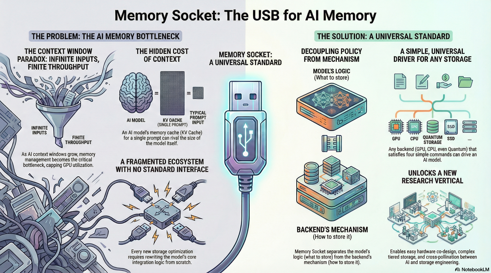

<div align="center">

**Academic Research and Technical Publications**

[](https://scholar.google.com/citations?view_op=list_works&hl=en&authuser=1&hl=en&user=W6IsSzUAAAAJ&authuser=1)

</div>

---

### 1. TempusBench: An Evaluation Framework for Time-Series Forecasting

**Venue:** NeurIPS 2025 Workshop - *Recent Advances in Time Series Foundation Models: Have We Reached the 'BERT Moment'?*

**Authors:** Denizalp Goktas, Gerardo Riano-Briceno, Alif Abdullah, Aryan Nair, Chenkai Shen, Beatriz de Lucio, Alexandra Magnusson, Farhan Mashrur, Ahmed Abdulla, Shawrna Rani Sen, Mahitha Thippireddy, Gregory E Schwartz, Amy Greenwald

An open-source evaluation framework for time-series foundation models (TSFMs) addressing critical gaps in current benchmarking practices. TempusBench introduces: (1) new datasets not included in existing TSFM pretraining corpora to prevent data contamination, (2) novel benchmark tasks evaluating core statistical properties like non-stationarity and seasonality, (3) a standardized hyperparameter tuning protocol for fair model comparison, and (4) a TensorBoard-based visualization interface.

[](https://scholar.google.com/citations?view_op=list_works&hl=en&authuser=1&hl=en&user=W6IsSzUAAAAJ&authuser=1)

---

### 2. Memory Socket: Universal Storage Interface for Neural Inference

**Type:** Technical Report | Sole Author



[](papers/Memory_Socket_Universal_Interface.pdf) [](https://drive.google.com/file/d/14C-YTXMcgmEHANAISGsfKdKff8-nJ6LM/view?usp=sharing)

---

### 3. Sleep Trouble and BMI in Adults Over 30

**Venue:** Academic Research Project

Statistical analysis examining the relationship between sleep quality and body mass index in adult populations, utilizing regression modeling and causal inference techniques.

[](https://github.com/ges257/msai-coursework/blob/main/reports/SleepBMI_Adults30_PhysActivity_Final.pdf)

---

## Repository Structure

```
research-and-publication-reports/
├── README.md
├── assets/
│   └── memory-socket-infographic.png
└── papers/
    └── Memory_Socket_Universal_Interface.pdf
```

*Additional papers hosted externally (Google Scholar / Google Drive / msai-coursework repo)*

---

<div align="center">

**Part of the AI/ML Portfolio**

[Return to Home](https://github.com/ges257) | [LinkedIn](https://linkedin.com/in/gregory-e-schwartz)

</div>


